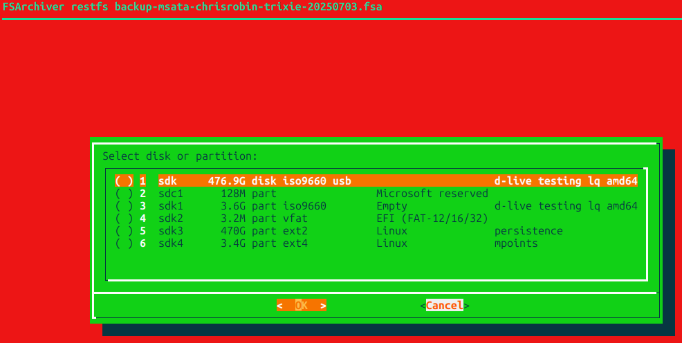
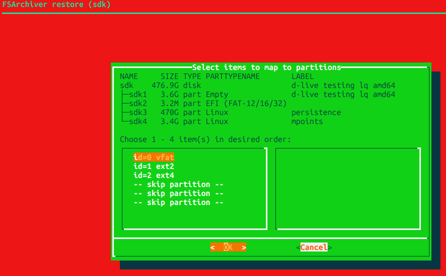
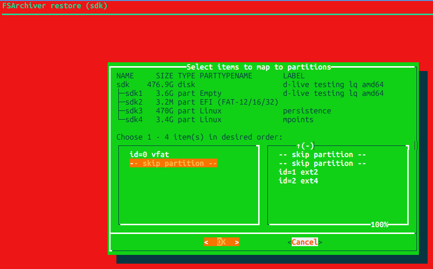

# fsarchiver-helpers User Guide


<picture>

</picture>


> [!IMPORTANT]
> fsarchiver-helpers requires a _local_ .mc.menu file in the directory where the fsarchiver archive(s) to be operated on reside(s)

---

### TOC
- [How to configure fsarchiver.tcl](GUIDE.md#how-to-configure-fsarchivertcl)
- [Display archive metadata](GUIDE.md#how-to-display-info-about-an-fsarchiver-archive)
- [Display installed filesystems](GUIDE.md#detection-of-filesystems)
- [How to mount and peruse an fsa filesystem](GUIDE.md#how-to-copyout-mount-and-peruse-an-fsarchiver-archive-filesystem)
- [How to restore filesystems from an archive](GUIDE.md#how-to-restore-filesystems-from-an-archive)
- [How to backup and restore directories](GUIDE.md#how-to-backup-and-restore-directories)

## How to configure fsarchiver.tcl

- Please refer to [Installation](README.md#installation)
- Colors of fsarchiver-helpers are configurable by changing the suggested skin color of mc and/or deleting/changing the autumndc.rc file in configdir

> [!IMPORTANT] 
> the reason for the default sharp colors is to remind the user (of fsarchiver-helpers) that credentials _have been elevated_)

[toc](GUIDE.md#toc)

## How to Display info about an fsarchiver archive

In Midnight Commander (mc)

+ navigate to a directory containing an fsarchiver file-system archive file (and .mc.menu)
+ Select an achive e.g. backup-msata-chrisrobin-trixie-20250621.fsa
+ keypress F2 (or mouse click on the Menu button at the bottom of the mc interface)
+ double click on:

```
fsarchiver archinfo
```


+ The info is presented in the mc Internal File Viewer (e.g. below)
  - keypress F1 for more info on the Internal File Viewer
  - keypress F10 to exit the Internal File Viewer


> [!TIP]
> for users who are not entirely familiar with mc, numbers next to menu items or buttons correspond to numbered function keys, you can use a corresponding keypress for most functions in mc (mc provides visual queues for most items i.e. which key to press). Even fsarchiver-helpers menu items could be assigned a keypress (but this is optional and left for customization)

[toc](GUIDE.md#toc)

## Detection of filesystems

+ navigate to a directory containing a _local_ .mc.menu file
+ keypress F2
+ double click on:

```
fsarchiver probe
```

+ The info is presented in the mc Internal File Viewer
  - keypress F1 for more info on the Internal File Viewer
  - keypress F10 to exit the Internal File Viewer

[toc](GUIDE.md#toc)

## How to copyout, mount and peruse an fsarchiver archive filesystem

+ navigate to a directory containing fsarchiver file-system archive file (and .mc.menu)
+ Select an achive e.g. backup-msata-chrisrobin-trixie-20250621.fsa
+ keypress F2
+ Inspect the archive via [fsarchiver archinfo](GUIDE.md#how-to-display-info-about-an-fsarchiver-archive)
  - e.g. In the example Internal File Viewer output, the main filesystem has an fsarchiver id=1 (i.e. it's an ext2 filesystem in the example)
+ double click on:

```
fsarchiver copyout (id=1)
```

  - this will start the copyout and a progress bar will appear in the mc internal shell line.
+ After the progress bar displays **DONE** then bring up the menu and double click:

```
fsarchiver mount backstores
```

+ The internal viewer will display where the mount point of the backingstore is located
+ Navigate to the mount point and the filesystem should be displayed in the mc panel. It is a fully restored filesystem. The only difference (effectively) is that it is contained in a backingstore file instead of a partition.
+ All normal directory, file activities can now be performed on the mounted backingstore e.g. selection of files, inspections, copies, deletes, edits, etc.

[toc](GUIDE.md#toc)

## How to restore filesystems from an archive

> [!IMPORTANT] 
> The copyout mechanism is _much_ safer than a direct restfs. Please be careful with restfs e.g. make sure the filesystems being written to are backed up, otherwise data loss can occur.

+ navigate to a directory containing an fsarchiver file-system archive file (and .mc.menu)
+ Select an achive e.g. backup-msata-chrisrobin-trixie-20250703.fsa
+ keypress F2
+ double click on:

```
fsarchiver restfs
```

  - This will bring up a disk/partition dialog
	- (Note that only disks and partitions that are _unmounted_ will be presented)



  - Disks are at the top of the list
  - Selecting a disk will allow for multiple filesystem restorals (depending on the current partion layout of the disk and the contents of the archive)
+ _After_ selecting one of the disks or partitions (an asterisk will populate an items parenthesis), click on **OK**
+ A choice of archive ids will be presented in a buildlist dialog



  - A buildlist dialog displays two lists, side-by-side. The list on the left shows **unselected** items. The list on the right shows **selected** items. As items are selected or unselected, they move between the lists.

  - In this _example_ the goal is to restore the third and forth partitions on /dev/sdk with the archive filesystems with ids 1 and 2.

  - The final selected list should look like:



  - Note how the **selected** list includes a "-- skip partition --" item in the first two items (i.e. partitions 1 and 2). The order of the selected list from top to bottom corresponds to the partition order of the disk being restored.

    - There is no danger when building the selected list as items can be moved between the lists as many times as needed to build any order necessary.

  - When the selected list reflects the mapping of archive id(s) to partitions, select OK
 
  - A final confirmation dialog will display the fsarchiver command line to be executed. Please check it for accuracy and either allow the command to go ahead or cancel it.

[toc](GUIDE.md#toc)

## How to backup and restore directories

### How to backup a directory

+ Navigate to the parent directory of the directory to be backed up.
+ Select the directory to be backed up
+ In the mc shell line type:

```
fsarchiver savedir %f.fsa %f
```

  - Please note that the above command will execute **fsarchiver** proper (not fsarchiver.tcl)

This will save the selected directory hierarchy to an fsa file (flat backup) in the parent directory. This flat backup can then be renamed and/or moved 

> [!CAUTION]
> Please be careful when typing a command in the shell line. Data can easily be lost if a mistake or typo is present

> [!TIP]
> putting commands into an mc menu item (user or local) can provide a little more safety, especially from typos. (Note that the user menu can be edited from the mc Command menu)

[toc](GUIDE.md#toc)

### How to restore a directory

+ navigate to a directory containing fsarchiver directory containing a directory backup (flat backup) file in one mc panel.
+ In the other mc panel navigate to the parent directory of the directory to be restored from the flat backup
+ Select the flat backup file
+ In the mc shell line type:
 
```
 fsarchiver restdir %f %D
```

  - Please note that the capitalization of the mc shell patterns in the above command. Also, this will execute **fsarchiver** proper (not fsarchiver.tcl)

[toc](GUIDE.md#toc)
