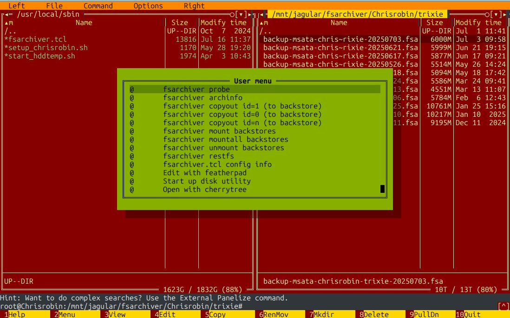

# fsarchiver-helpers User Guide



> [!IMPORTANT]
> fsarchiver-helpers requires a _local_ .mc.menu file in the directory where the fsarchiver archive(s) to be operated on reside(s)

## How to Display info about an fsarchiver archive
In Midnight Commander (mc)

+ navigate to a directory containing fsarchiver file-system archive file
+ Select an achive e.g. backup-msata-chrisrobin-trixie-20250621.fsa
+ keypress F2 (or mouse click on the Menu button at the bottom of the mc interface)
+ double click on:

```
fsarchiver archinfo
```


+ The info is presented in the mc Internal File Viewer (e.g. below)
  - keypress F1 for more info on the Internal File Viewer
  - keypress \<ESC\> to dismiss each popup in turn


> [!TIP]
> for users who are not entirely familiar with mc, numbers next to menu items correspond to numbered function keys, you can use a corresponding keypress for most functions in mc (mc provides visual queues for most items i.e. which key to press). Even fsarchiver-helpers menu items could be assigned a keypress (but this is optional and left for customization)

## Detection of filesystems

+ navigate to a directory containing a _local_ .mc.menu file
+ keypress F2
+ double click on + double click on:

```
fsarchiver probe
```

## How to copyout, mount and peruse an fsarchiver archive filesystem
+ navigate to a directory containing fsarchiver file-system archive file
+ Select an achive e.g. backup-msata-chrisrobin-trixie-20250621.fsa
+ keypress F2
+ Inspect the archive via [fsarchiver archinfo](GUIDE.md#how-to-display-info-about-an-fsarchiver-archive)
  - e.g. In the example Internal File Viewer output, the main filesystem has an fsarchiver id=1 (i.e. it's an ext2 filesystem in the example)
+ double click on:

```
fsarchiver copyout (id=1)
```

  - this will start the copyout and a progress bar will appear in the mc internal shell line.
+ After the progress bar displays **DONE** then bring up the menu and double click:

```
fsarchiver mount backstores
```

+ The internal viewer will display where the mount point of the backingstore is located
+ Navigate to the mount point and the filesystem should be displayed in the mc panel. It is a fully restored filesystem. The only difference (effectively) is that it is contained in a backingstore file instead of a partition.
+ All normal directory, file activities can now be performed on the mounted backingstore e.g. selection of files, inspections, copies, deletes, edits, etc.