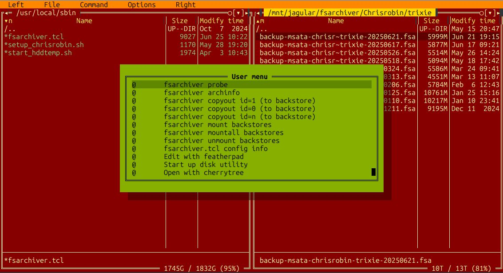

#  fsarchiver-helpers

fsarchiver: helper scripts and approach(es)

primarily, _fsarchiver-helpers_ is a restoral tool for fsarchiver _filesystem_ backups

leverages [FSArchiver](https://www.fsarchiver.org/), [Midnight Commander](https://midnight-commander.org/) (mc), [dialog](https://invisible-island.net/dialog/) and linux, to enable some features not found in FSArchiver itself and perhaps mitigate some of the facility and data reflection issues.


> [!NOTE] 
> FSArchiver proper can also back up directory hierarchies via savedir, the output format is different e.g. flat backup and restoral menu items can be inserted directly into mc menus; i.e. no need for intermediate filesystem or loop device

## Benefits
+ [TUI](https://en.wikipedia.org/wiki/Text-based_user_interface) _enabled by mc_ e.g. menus, popups, keycodes, customization, etc.
+ FSArchiver:
  + file-system can be restored to a partition with different size and different file-system type
  + archives can be stored anywhere (i.e. vs snapshots that reside on the same media as the original)
+ fsarchiver-helpers:
  + archives can be inspected for content or meta-data via mc
  + fine grain restoral control (e.g. individual files, directories)
  + archive testing
  + full disk or partition restore _facility_

## Overview 
Typical usage with mc is to start up mc via: 

```bash
 sudo COLORTERM=truecolor mc --skin=seasons-autumn16M
```

+ navigate to a directory containing fsarchiver file-system archive file
+ keypress F2 and a menu of options will display:



+ Local menu shows items that include fsarchiver-helper operators and additional items as desired
  + Note that the copyout operators perform the bulk of the help, as they execute _fsarchiver restfs_ with desired parameters 
+ keypress \<ESC\> to dismiss the menu
+ select an archive of interest
+ keypress F2 and double-click an operator
+ Please see the [fsarchiver-helpers Users Guide](GUIDE.md) for more details

## Dependencies
+ elevated credentials
+ loop device capability (e.g. losetup must work, default in most kernel setups but I ran into an issue with Arch)
+ mc, FSArchiver, [tclsh](https://sourceforge.net/projects/tcl/files/) (version 9.0+ is recommended), [dialog](https://invisible-island.net/dialog/)
+ The user is expected to have intermediate facility with mc and FSArchiver.
+ Enough free space for 3 backingstore files (e.g. 3 * 200G = 600G)
  - (this is configurable) 
+ (TBD) fsarchiver-helpers makes no provision for encrypted archives currently

## Installation
+ Download [fsarchiver-helpers]() (e.g. via git clone or equivalent operation provided by the repository)
+ Download [tclsh](https://sourceforge.net/projects/tcl/files/) version 9+ and install it (default install location is /usr/local/bin)

```bash 
    cd tcl/unix
    ./configure
    make install
```
  

+ edit .fsarchiver.rc.tcl
    - Change the values of the following parameters as desired:
      - **tclsh** - absolute path to the installed tclsh (e.g. /usr/local/bin/tclsh9.0)
      - **configdir** - location of configuration files (e.g. ~/.config/fsarchiver-helpers)
      - **backfsdir** - location of backingstore files (e.g. /mnt/bees)
      - **backfssize** - size of backingstore files (e.g. 200G)
	  - **backfstag** - backing store file/container prefix (e.g. c200)
      - **mountfsdir** - mount point head directory (e.g. /media/root)
      - **nthr** - number of fsarchiver compression threads (e.g. 8)
 
+ Run the install.sh script

```bash
    sudo ./install.sh
```

#### Creating an fsarchiver mc local menu
+ Start up mc as per [Overview](README.md#overview)
+ Navigate to a directory containing an fsarchiver archives
+ In the mc shell line type:
```
fsarchiver.tcl mclocalmenu %d
```

> [!IMPORTANT]
> This will create an fsarchiver-helpers .mc.menu file in the current mc panel directory (i.e. %d is an mc special shell variable - See the [mc man page](https://source.midnight-commander.org/man/mc.html#Macro_Substitution) for further details)

+ To test installation of .mc.menu keypress F2 (and the fsarchiver menu should display)

## Conventions, suggestions, notes
   - Set backfsdir to the fastest storage device available as this will speed up copyout operators (keep in mind that this is a work space and probably doesn't need to be backed up)
   - naming conventions for FSArchiver archives
     - consistency and helpful names & directories that provide a cue to content is suggested
     - FSArchiver archives should be given a consistent suffix (e.g. .fsa)
   - The naming convention for the backingstore files (bsf) serves only as a cue to content
     - fsarchiver.tcl will inspect the file system type associated with an id in a backup file. Effectively, btrfs file system backups will be copied to the btrfs bsf, while filesytem types that contain the string "fat" will be copied to  the vfat bsf and everything else will be copied to the ext4 bsf e.g. c200_ext4.img. Since fsarchiver will actually format the bsf according to the filesystem type stored in the backup, the naming convention has no functional effect.
   - Note that copyout will display a progress bar (via dialog) that waits for the fsarchiver I/O thread to finish before closing.
     - when fsarchiver has completely terminated the mc panel display will return
   - TBW 
     - using [Cherrytree](https://www.giuspen.net/cherrytree/) to codify backup & restoral steps on multiple systems
     - Combining mc with [konsole](https://konsole.kde.org) shortcuts or [qterminal](https://github.com/lxqt/qterminal) bookmarks
     - Combining [tmux](https://github.com/tmux/tmux/wiki) with mc
   

